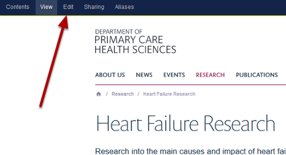
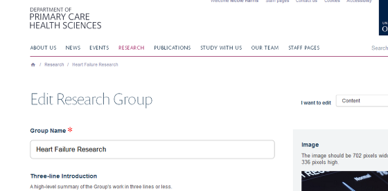
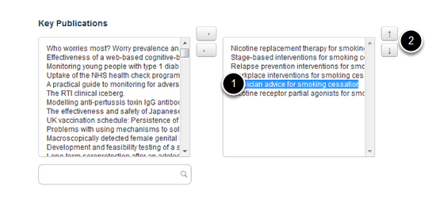

Change the Order of Publications on a Research Group Page
======================================================================================================

You can change the order in which publications are displayed on your Research Group page. 	

Select edit mode
-------------------------------------------------------------------------------------------

   

Go to the Research section of your website and find the Research Group page you would like to edit. Click on edit on the tool bar at the top of the page to bring up the editing interface: 

   

Change order of publications
-------------------------------------------------------------------------------------------

   

Scroll down the page until you reach the Key Publications section at the bottom of the page. The box on the right shows the publications on your Research Group in display order. To change the order:
1. Highlight the publication you would like to move.
2. Use the up and down arrows to move it to the right location. 

Save your changes
-------------------------------------------------------------------------------------------

   

Save your changes (the Save button is at the bottom of the page). 

