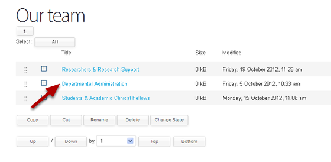
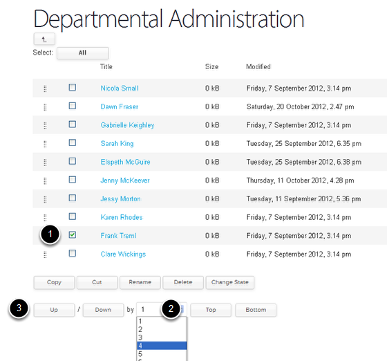
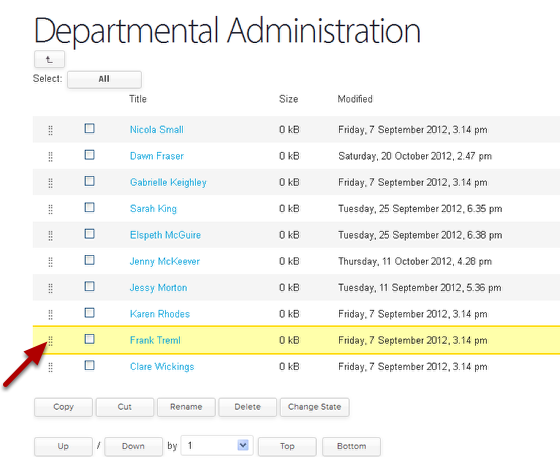

Change the Order of Team Members
======================================================================================================

There are two ways in which you can change the order of the Team Members in the Our team section; either by choosing how many places in the list you would like to move the person or by dragging and dropping the name to the required place. 	

Our Team section
-------------------------------------------------------------------------------------------

   

Go to the Our Team section and click on Contents on the top toolbar.

Contents view
-------------------------------------------------------------------------------------------

   

Click on the Team section that you would like to reorder. 

Moving people by a specified number of places
-------------------------------------------------------------------------------------------

   

This is the first way in which you can move people. 
1. Select the person you would like to move.
2. From the drop down menu choose how many place up or down the list you would like to move the person.
3. Click on the Up or Down button to make the move.

Drag and drop
-------------------------------------------------------------------------------------------

   

This is the second way in which you can move people.
Find the name you would like to move and click on the set of dots next to it higlighting the name. Keep your mouse button held down and drag the name to the required location in the list.

