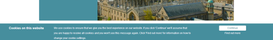
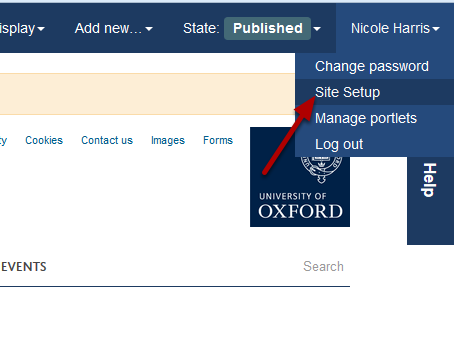
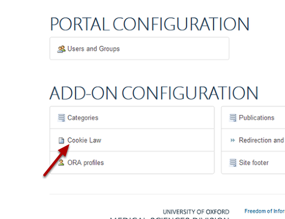
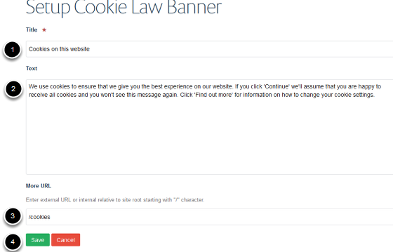

Change the Text and Link on the Cookie Banner
======================================================================================================

.. note:: These user guides are being phased out and replaced with the guides on `Haiku Knowledge Base <https://fry-it.atlassian.net/wiki/display/HKB/Haiku+Knowledge+Base>`_

The Cookie Banner displays at the bottom of the screen the first time someone comes to your site. You can change the text on the banner and the page that the **Find out more** text links to. This shows you how to change the text and link on the banner.

If the Cookie Banner isn't working on your site email haiku@medsci.ox.ac.uk asking for it to be switched on. 	

   

Site Setup
-------------------------------------------------------------------------------------------

   

Click on your name on the right side of the page. 
Select **Site Setup** from the drop down menu. 

Cookie Law
-------------------------------------------------------------------------------------------

   

Click on **Cookie Law**.

   

Make your changes:
1. This text appears in bold on the left of the banner.
2. Main banner text.
3. This is the page which the **Find out more** text links to. Don't enter the www.deptname.ox.ac.uk part of the address. 
4. Save your changes.

