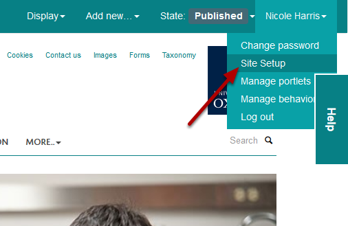
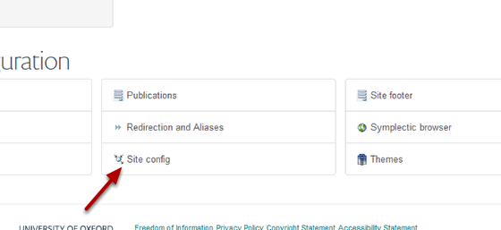
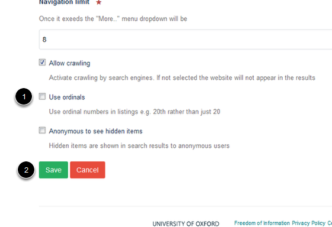

Choose the Date Format on Event Pages
======================================================================================================

.. note:: These user guides are being phased out and replaced with the guides on `Haiku Knowledge Base <https://fry-it.atlassian.net/wiki/display/HKB/Haiku+Knowledge+Base>`_

You can choose whether dates on events on your site display with or without ordinals eg.  1st April or 1 April**.**
**Note:** The University style guide states that dates should be displayed without ordinals. The style guide is available for download from: http://www.ox.ac.uk/public_affairs/services_and_resources/style_guide/index.html	

Site Setup
-------------------------------------------------------------------------------------------

   

Click on your name on the toolbar and select **Site Setup** from the drop down list. 

Site config
-------------------------------------------------------------------------------------------

   

Click on **Site config**.

Use ordinals
-------------------------------------------------------------------------------------------

   

1. Select the **Use ordinals** checkbox if you would like to your dates to include ordinals.
2. Save your changes.

