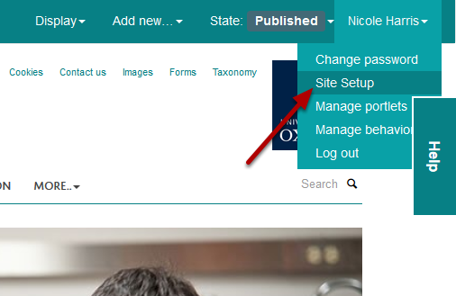
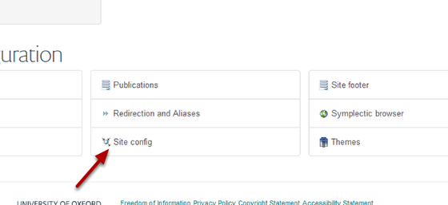
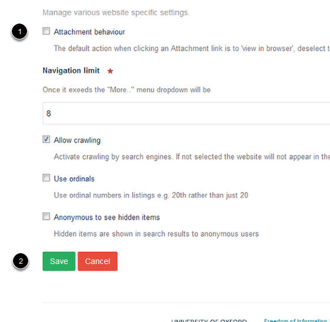

Choose whether Attachments are Downloaded or Opened in the Browser
======================================================================================================

.. note:: These user guides are being phased out and replaced with the guides on `Haiku Knowledge Base <https://fry-it.atlassian.net/wiki/display/HKB/Haiku+Knowledge+Base>`_

You can choose whether attachments (eg Pdf or Word documents) uploaded to your site open in the browser window or download. 	

Site Setup
-------------------------------------------------------------------------------------------

   

Click on your name on the toolbar and select **Site Setup** from the drop down list. 

Site config
-------------------------------------------------------------------------------------------

   

Click on **Site config**.

Attachment behaviour
-------------------------------------------------------------------------------------------

   

1. Select the **Attachment Behaviour** checkbox if you would like attachments to download. If the box is unchecked attachments will open in the browser window. 
2. Click on **Save**. 

