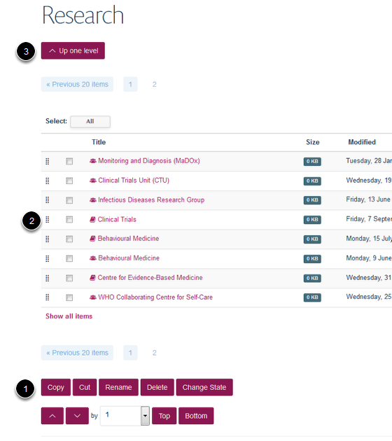

Contents, View and Edit buttons
======================================================================================================

The tool bar at the top of the screen gives you access to the various editing functions that you will need. This tutorial looks at the **Contents, View and Edit** buttons. These are the buttons that you will be using most when you make changes to your site. 	

Tool bar
-------------------------------------------------------------------------------------------

   

When you log in to your site and go to pages you have permission to edit you should see a toolbar at the top of the screen.

View button
-------------------------------------------------------------------------------------------

   

View is the default option when you log in showing you what the webpage looks like. 
If you are making changes to your webpage in the Editing or Contents interface you can click on View to see what your alterations look like. (Remember to save your changes before clicking on View.)

Edit button
-------------------------------------------------------------------------------------------

   

Clicking on the Edit button gives you access to the Editing interface of the page that you are currently viewing:

Editing interface
-------------------------------------------------------------------------------------------

   

You can now make changes to the different parts of your webpage. 

Contents button
-------------------------------------------------------------------------------------------

   

Clicking on the Contents button gives you a view of the page structure of the part of the website that you are currently on. For example clicking on Contents in the Research section of the website above shows you a list of all the Research Theme and Research Group pages:

   

1. You can use this interface to carry out tasks such as deleting, moving, copying and renaming the URL of your content. 
2. You can move around the different pages of the website in the Contents interface by clicking on the page name to move to pages lower down the hierarchy or (3.) using the up arrow to move to pages higher up. 

You will probably not need to use the Contents interface for most of your editing work. If you have any doubts about how this works please ask us. 

