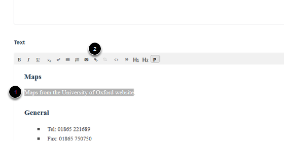
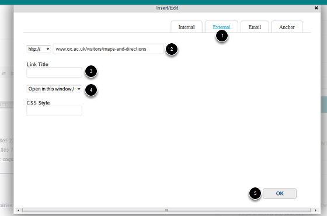
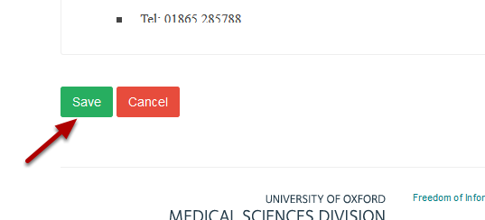

Create a Link to an External Website
======================================================================================================

.. note:: These user guides are being phased out and replaced with the guides on `Haiku Knowledge Base <https://fry-it.atlassian.net/wiki/display/HKB/Haiku+Knowledge+Base>`_

You can create links to external website, to pages within your site and to email addresses. This shows you how to link to an external website.	

Go to your page
-------------------------------------------------------------------------------------------

   

Go to the page where you would like to create the link. Click on **Edit** on the toolbar at the top of page. 

Go to the Text editor
-------------------------------------------------------------------------------------------

   

Scroll down the page until you reach the Text box.
1. Highlight the text you would like to create the link on.
2. Click on the link icon. This will bring up the link creation box.

Create your link
-------------------------------------------------------------------------------------------

   

1. Select external
2. Enter your web address
3. The Link Title can be used to provide more information about the link. 
4. You can select whether you would like the link to open in a new browser window.
5. Click on OK. 

Save your changes
-------------------------------------------------------------------------------------------

   

Scroll down to the bottom of the page and click on **Save**.

