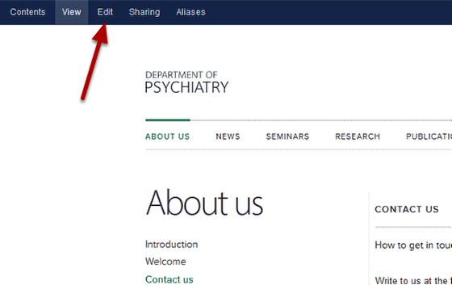
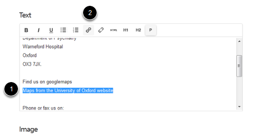
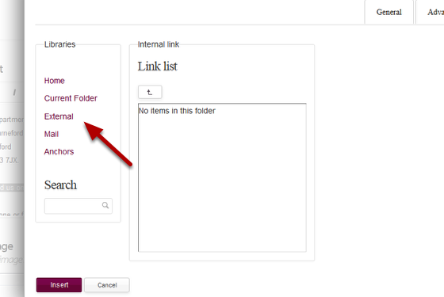
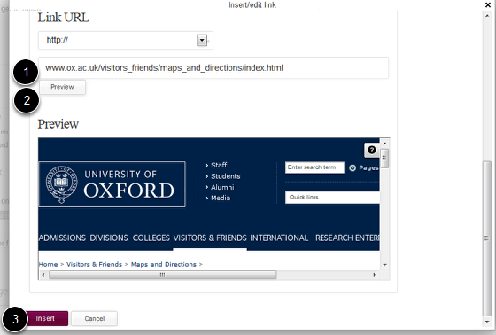
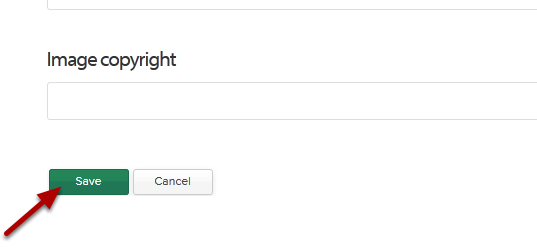

Create a Link to an External Website
======================================================================================================

You can create links to external website, to pages within your site and to email addresses. This shows you how to link to an external website.	

Go to your page
-------------------------------------------------------------------------------------------

   

Go to the page where you would like to create the link and click on Edit on the top right hand side of the blue toolbar on the top of page. 

Go to the Text editor
-------------------------------------------------------------------------------------------

   

Scroll down the page until you reach the Text box.
1. Highlight the text you would like to create the link on.
2. Click on the link icon. This will bring up the link creation box.

Create your link
-------------------------------------------------------------------------------------------

   

To create a link to an external website click on External and scroll down in the link creation box until you reach the Link URL section:

   

1. Type or paste your URL into the box.
2. Click on Preview.
3. Click on Insert.

Save your changes
-------------------------------------------------------------------------------------------

   

Scroll down to the bottom of the page and click on Save.

