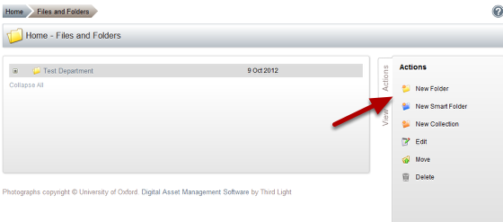
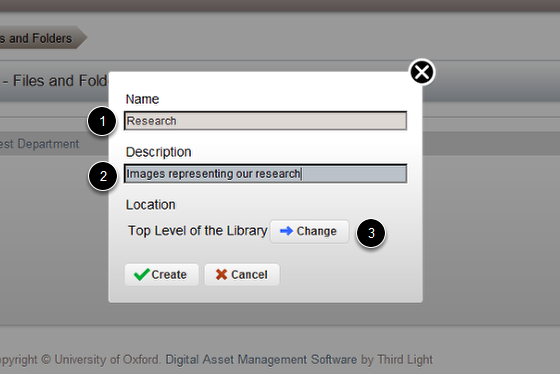
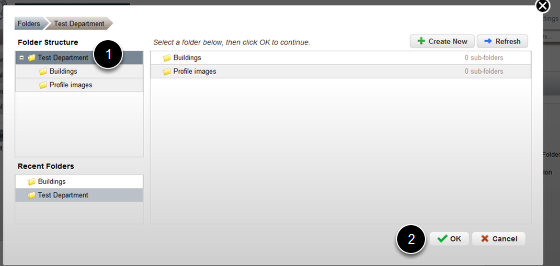
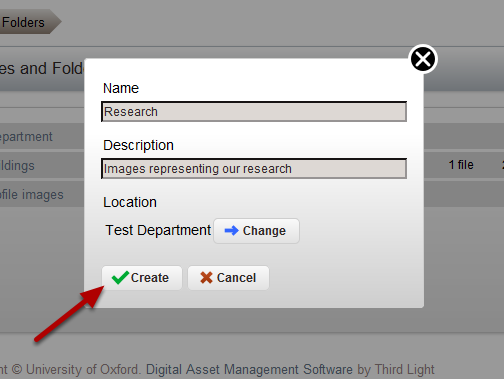
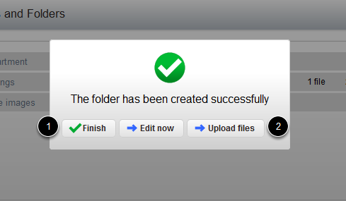

Create a New Folder in the Image Management System
======================================================================================================

This shows you how to create a new folder in the Image Management System. 	

New Folder
-------------------------------------------------------------------------------------------

   

Click on New Folder.

Name the new folder
-------------------------------------------------------------------------------------------

   

1. Enter the folder name.
2. Enter a description of the content of the folder.
3. Click on Change. This takes you to the following page where you can specify where you would like to create your folder. 

Choose the folder location
-------------------------------------------------------------------------------------------

   

1. Click on the folder where you would like to add the new folder.
2. Click on OK.

Create the folder
-------------------------------------------------------------------------------------------

   

Click on Create.

   

1. Click on Finish to create the folder, or 
2. Click on Upload files if you want to create the folder and add files to the folder. 

