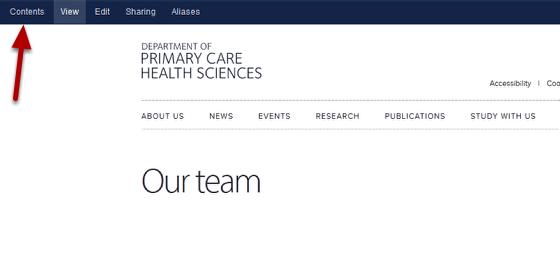
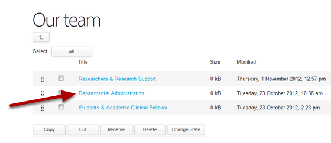
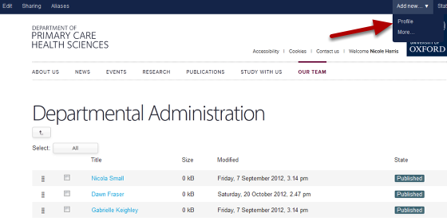
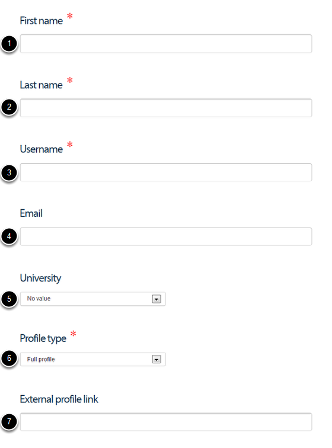
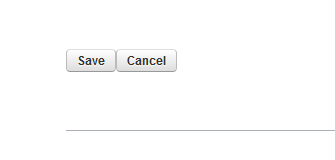

Create a New Profile
======================================================================================================

This shows you how to create profiles for new members of staff. There are three different types of profiles: 
1. Full profiles give the member of staff an opportunity to include information about themselves, a photo, details of their publications etc.
2. Stub profiles appear in staff listings giving a name and job title. You can't add any further information.
3. External profiles give you a way of including team members from other institutions - you can link their profile to information about them on an external website. 	

Our team 
-------------------------------------------------------------------------------------------

   

Go to the Our Team section of the website and click on the Contents button on the toolbar at the top of the page. 

Our team - contents view
-------------------------------------------------------------------------------------------

   

Click on the Team section where you would like to add the new profile.

Add new Profile option
-------------------------------------------------------------------------------------------

   

Click on the Add new button from the top right hand side of the top toolbar and select Profile.

Add Profile details
-------------------------------------------------------------------------------------------

   

To create a profile add the following details:

1. First name
2. Last name
3. The SSO username (for external profiles make up a username - external team members aren't able to edit anything on their profiles)
4. Email address
5. This is only for external profiles - if you would like the university logo of the external organisation to appear to the right of the person's name in the staff lists (in the same location as a profile image appears) select the university from the drop down list. If the university you need doesn't appear in the drop down list please contact us - haiku@medsci.ox.ac.uk
6. Select the profile type you would like from the drop down list - Full profile, Stub profile or External profile
7. This is only for external profiles - if your external team member has profile information on their home institution website enter the web address here

Save the profile
-------------------------------------------------------------------------------------------

   

Scroll to the bottom of the page and save the profile. 
Staff members with full profiles can now edit them. 
Publish profiles when they are ready to be seen by the public. 

