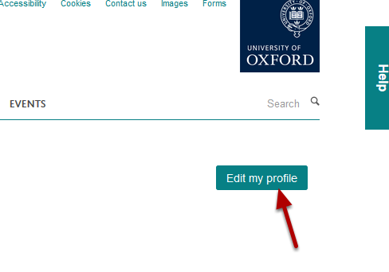
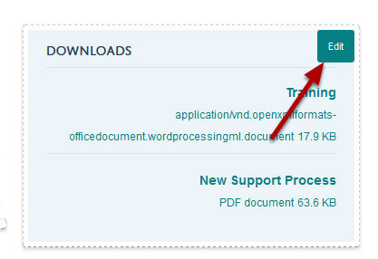
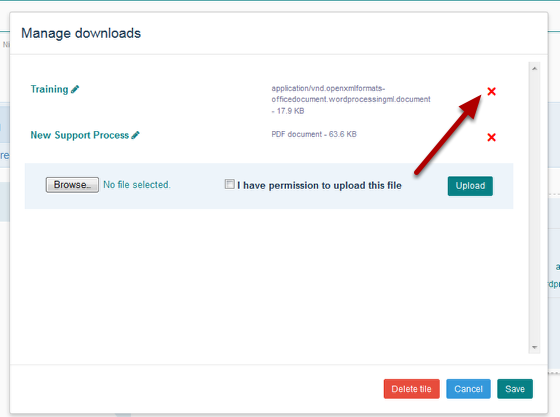
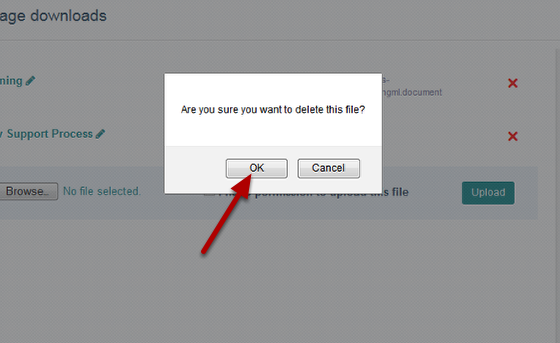
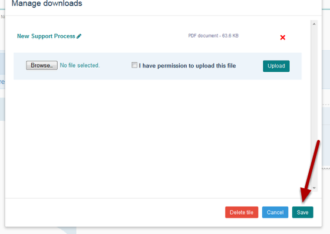
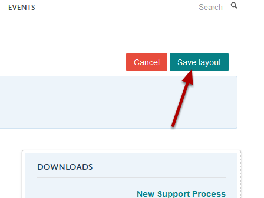

Delete a Document from your Profile
======================================================================================================

.. note:: These user guides are being phased out and replaced with the guides on `Haiku Knowledge Base <https://fry-it.atlassian.net/wiki/display/HKB/Haiku+Knowledge+Base>`_

This show you how to delete a document that you have uploaded to your profile.	

Edit profile
-------------------------------------------------------------------------------------------

   

Click on the **Edit my profile** button under the University logo.

Edit download tile
-------------------------------------------------------------------------------------------

   

Click on the **Edit** button on the Download tile. The Edit button will appear when you move your cursor over the Downloads heading. 

Delete your document
-------------------------------------------------------------------------------------------

   

Click on the red cross next to the document you would like to delete.

   

Click on **OK**.

   

Click on the **Save** button.

Save Profile layout
-------------------------------------------------------------------------------------------

   

Click on the **Save layout** button under the University logo.

