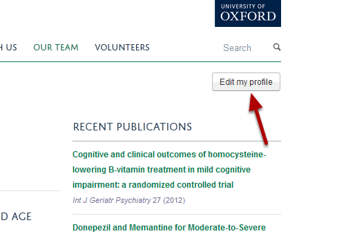
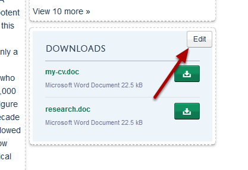
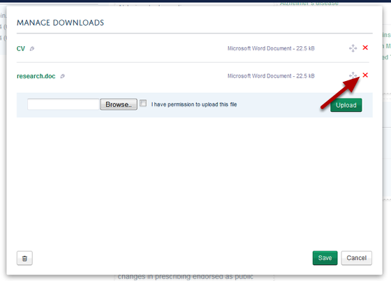
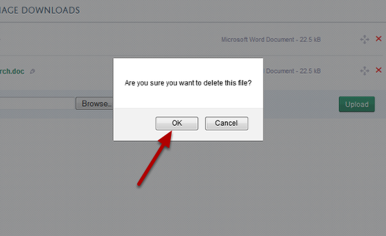
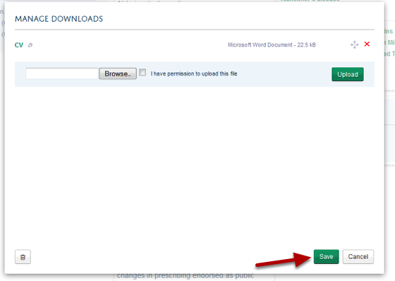
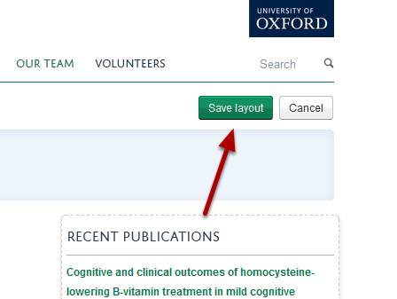

Delete a Document from your Profile
======================================================================================================

This show you how to delete a document that you have uploaded to your profile.	

Edit profile
-------------------------------------------------------------------------------------------

   

Click on the Edit my profile button located under the University logo.

Edit download files
-------------------------------------------------------------------------------------------

   

Click on the Edit button on the Download tile. The Edit button will appear when you move your cursor over the Downloads heading. 

Delete your document
-------------------------------------------------------------------------------------------

   

Click on the red cross next to the document you would like to delete.

   

Click on OK.

   

Click on the Save button.

Save Profile layout
-------------------------------------------------------------------------------------------

   

When you have finished making your changes go to the top of your page and click on the Save layout button under the University logo.

