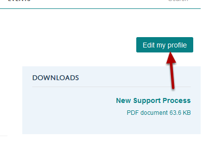
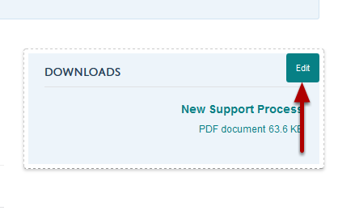
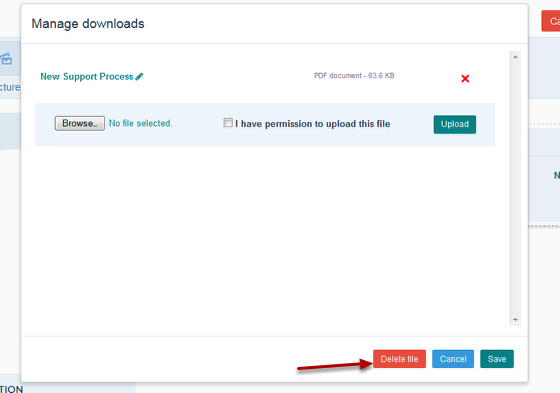
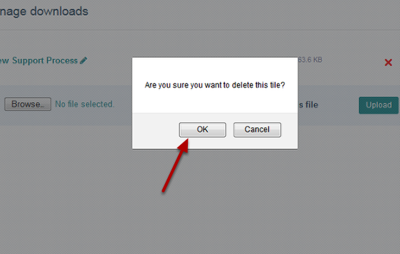
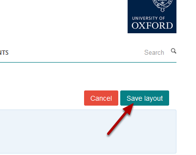

Delete a Download Tile from your Profile
======================================================================================================

.. note:: These user guides are being phased out and replaced with the guides on `Haiku Knowledge Base <https://fry-it.atlassian.net/wiki/display/HKB/Haiku+Knowledge+Base>`_

This shows you how to delete a download tile from your profile. If you would like to delete a document rather than the whole tile please see the Delete a Document from your Profile tutorial.	

Edit your profile
-------------------------------------------------------------------------------------------

   

Click on the **Edit my profile** button at the top of the page under the University logo. 

Edit download tile
-------------------------------------------------------------------------------------------

   

Click on the **Edit** button on the Downloads tile. This button appears when you move your cursor over the Downloads heading. 

Delete tile
-------------------------------------------------------------------------------------------

   

Click on **Delete tile**.

   

Click on **OK**.

Save the page layout
-------------------------------------------------------------------------------------------

   

Click on the **Save layout** button. 

