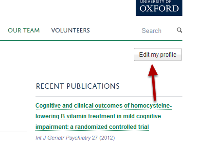
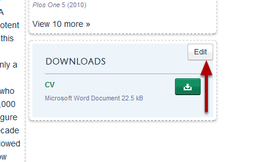
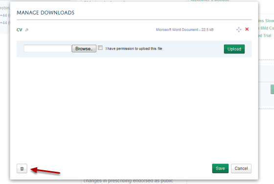
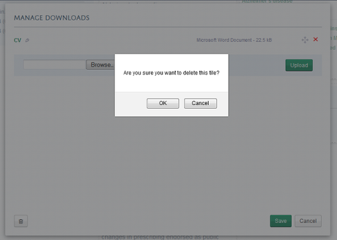
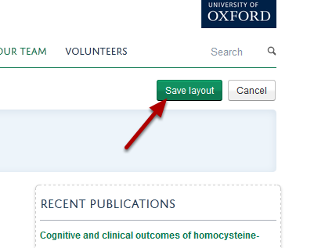

Delete a Download Tile from your Profile
======================================================================================================

This shows you how to delete a download tile from your profile. If you would like to delete a document rather than the whole tile please see the Delete a Document from your Profile tutorial.	

Edit your profile
-------------------------------------------------------------------------------------------

   

Click on the Edit my profile button at the top of the page under the University logo. 

Edit download tile
-------------------------------------------------------------------------------------------

   

Click on the Edit button on the download tile. This button appears when you move your cursor over the Downloads heading. 

Delete tile
-------------------------------------------------------------------------------------------

   

To delete the download tile click on the delete/rubbish bin icon at the bottom left hand side of the page. 

   

Click on OK.

Save the page layout
-------------------------------------------------------------------------------------------

   

Go to the top of your profile and click on the Save layout button. 

