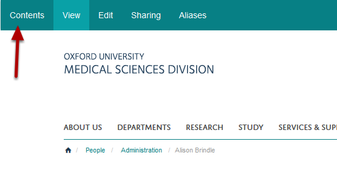
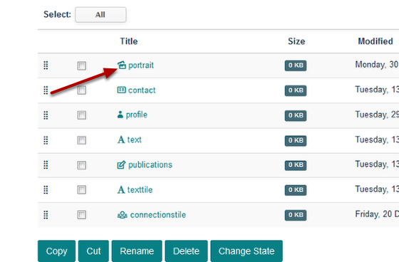
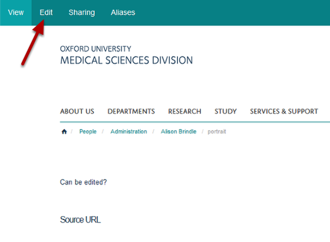
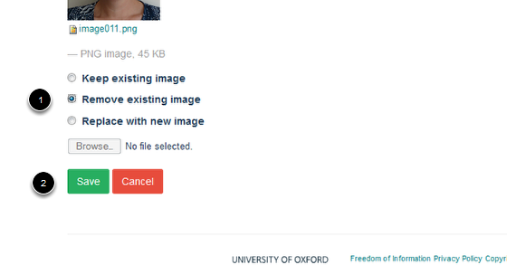

Delete a Profile Image
======================================================================================================

This tutorial describes how to delete a profile image. 	

Go to the profile
-------------------------------------------------------------------------------------------

   

Go to the profile you would like to delete the image from. 
Click on **Contents** on the left hand side of the toolbar at the top of the screen.

Select portrait
-------------------------------------------------------------------------------------------

   

Click on p**ortrait**.

Edit Portrait
-------------------------------------------------------------------------------------------

   

Click on the **Edit** at the top of the page to bring up the editing interface. 

Remove image
-------------------------------------------------------------------------------------------

   

Scroll down to the bottom of the page: 
1. Select the **Remove existing image** option.
2. Click on the **Save** button. 

