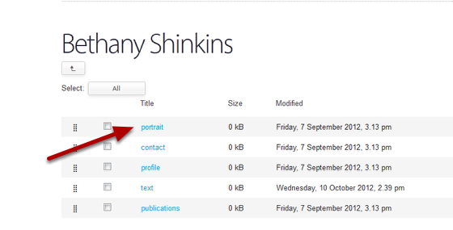

Delete a Profile Image
======================================================================================================

This tutorial describes how to delete a profile image. 	

Find the profile
-------------------------------------------------------------------------------------------

   

Go to the profile you would like to delete the image from. 
Click on the Contents button on the left hand side of the toolbar at the top of the screen.

Select portrait
-------------------------------------------------------------------------------------------

   

Click on portrait.

Editing interface
-------------------------------------------------------------------------------------------

   

Click on the Edit button at the top of the page to bring up the editing interface. 

Remove image
-------------------------------------------------------------------------------------------

   

Scroll down to the bottom of the page: 
1. Click the Remove existing image option.
2. Click on Save button. 

