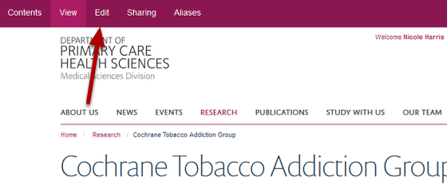
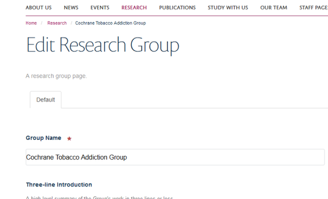
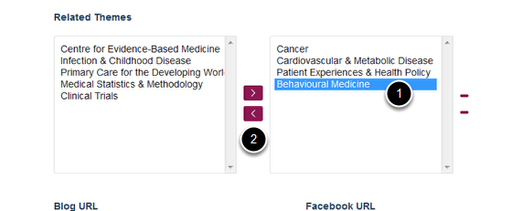
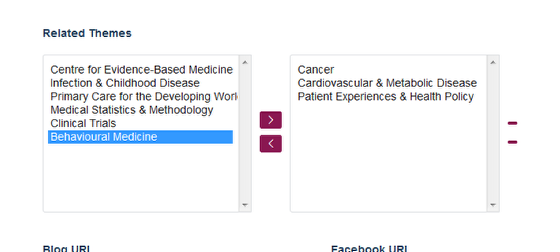
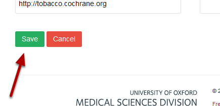

Delete a Research Group from a Research Theme
======================================================================================================

This shows you how to delete a Research Group from a Research Theme. 

Research Themes are allocated to Research Groups. You need to go to the Research Group page to delete it from the Research Theme. 	

Switch to Edit mode
-------------------------------------------------------------------------------------------

   

Go to your Research Group.
Click on **Edit** on the toolbar at the top of the page to bring up the editing interface:

   

Related Themes
-------------------------------------------------------------------------------------------

   

Scroll down the page until you reach the Related Themes section. The column on the right shows which Research Themes the Research Group belongs to. (The column on the left lists the Research Themes which the Research Group doesn't belong to.)
1. Select the Research Theme you would like to delete your Research Group from.
2. Click on the bottom arrow to remove the Research Theme from the Research Group. This moves it back to the left hand column:

   

Save your changes
-------------------------------------------------------------------------------------------

   

Click on the **Save** button at the bottom of the page. 

