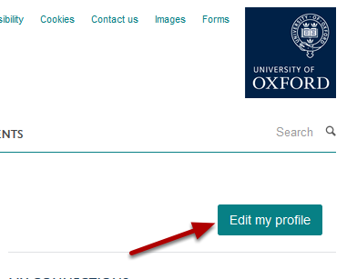
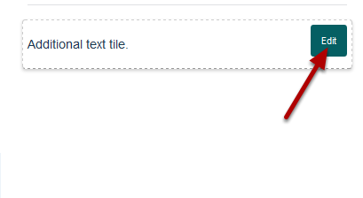
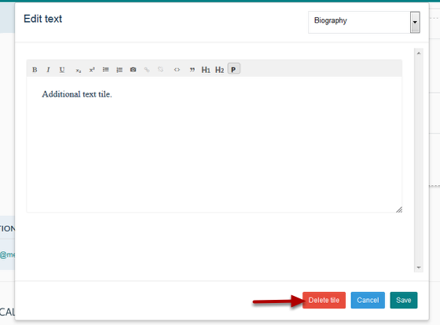
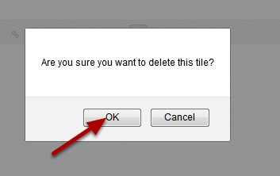
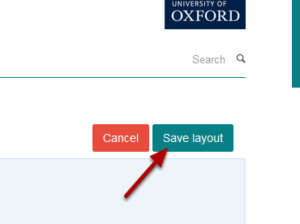

Delete a Text Tile from your Profile
======================================================================================================

.. note:: These user guides are being phased out and replaced with the guides on `Haiku Knowledge Base <https://fry-it.atlassian.net/wiki/display/HKB/Haiku+Knowledge+Base>`_

This shows you how to delete a Text Tile from your Profile. 	

Edit Profile
-------------------------------------------------------------------------------------------

   

Log in and go to your profile. Click on the **Edit my profile** button on the right of the page under the University logo. 

Delete tile
-------------------------------------------------------------------------------------------

   

Go to the text tile you would like to delete and click on **Edit**. This button appears when you hover over the text tile. 

   

Click on the **Delete tile** button at the bottom of the text tile's editing interface. 

   

Click on OK.

Save layout
-------------------------------------------------------------------------------------------

   

Click on the **Save layout** button on the top right of the page. 

