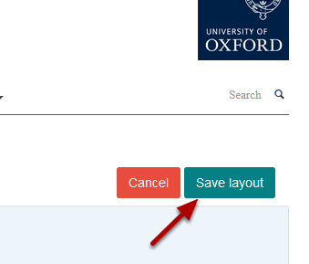

Delete a Video from your Profile
======================================================================================================

.. note:: These user guides are being phased out and replaced with the guides on `Haiku Knowledge Base <https://fry-it.atlassian.net/wiki/display/HKB/Haiku+Knowledge+Base>`_

This show you how to delete a video from your profile. 	

Edit profile
-------------------------------------------------------------------------------------------

   

Click on **Edit my profile** below the University logo. 

Edit video
-------------------------------------------------------------------------------------------

   

Go to the video your would like to delete and click on **Edit**. This button appear when you hover over the video. 

Delete video
-------------------------------------------------------------------------------------------

   

Click on **Delete tile**.

   

Click on **OK**.

Save layout
-------------------------------------------------------------------------------------------

   

Click on the **Save layout** button below the University logo.

