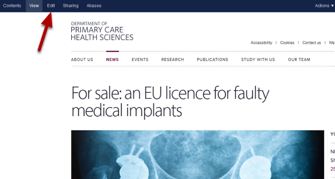

Edit a News Item
======================================================================================================

.. note:: these user guides are being phased out and replaced with the guides on `Haiku Knowledge Base <https://fry-it.atlassian.net/wiki/display/HKB/Haiku+Knowledge+Base>`_

   

Go to the News Item you would like to edit and click on the Edit button on the left hand side of the tool bar at the top of the page. 

