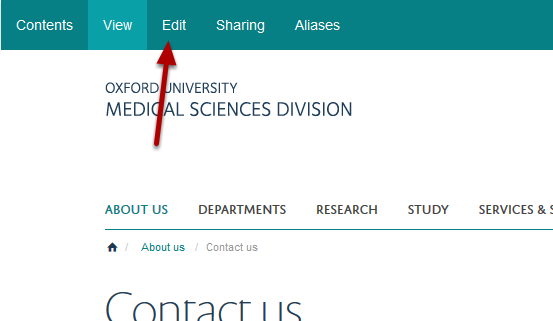
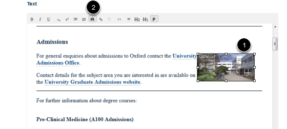
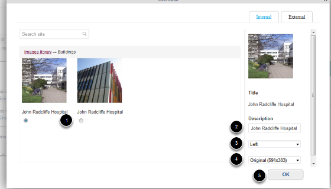
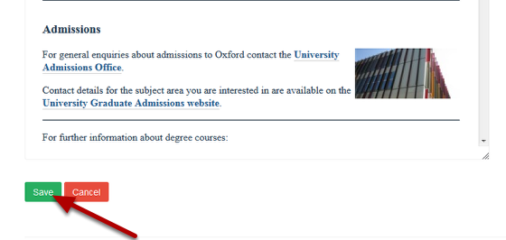

Edit an Image in the Main Text of your Page
======================================================================================================

.. note:: These user guides are being phased out and replaced with the guides on `Haiku Knowledge Base <https://fry-it.atlassian.net/wiki/display/HKB/Haiku+Knowledge+Base>`_

This shows you how to edit an image added to the main text content of your page. 	

Edit page
-------------------------------------------------------------------------------------------

   

Go to the page with the image you would like to edit. Click on **Edit**.

   

1. Click on the image you would like to edit (you can delete the image at this point by pressing your Delete key).
2. Click on the camera icon to bring up the image details:

   

You have the following options:
1. Choose a different image. 
2. Change the description. 
3. Change the spacing around the image. 
4. Chnage the size of the image.

5. Click on OK.

Save your changes
-------------------------------------------------------------------------------------------

   

Click on **Save**.

