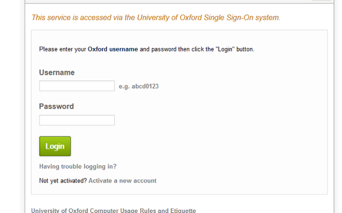
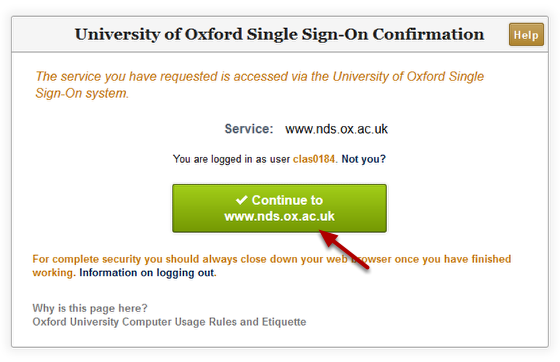
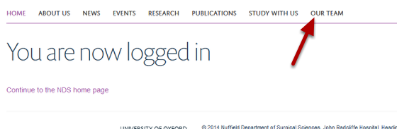
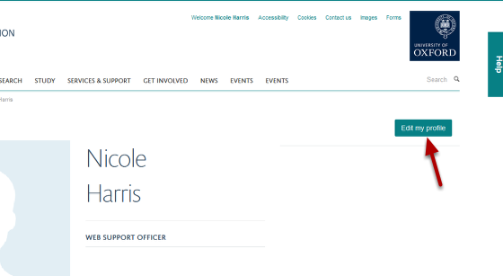
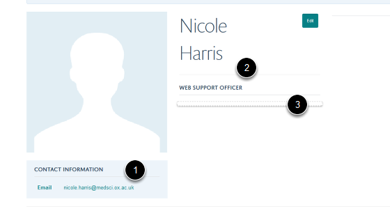
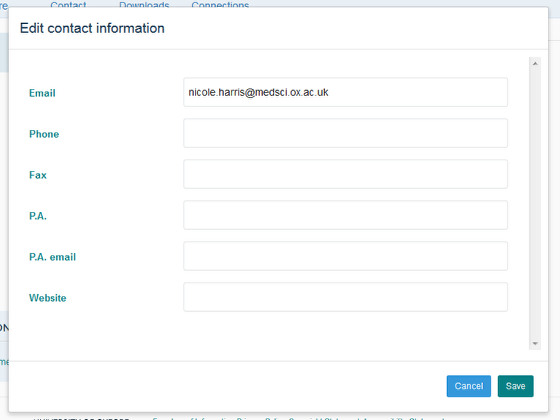
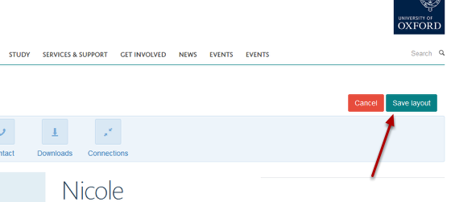

Edit your Profile - an overview
======================================================================================================

.. note:: These user guides are being phased out and replaced with the guides on `Haiku Knowledge Base <https://fry-it.atlassian.net/wiki/display/HKB/Haiku+Knowledge+Base>`_

Log in
-------------------------------------------------------------------------------------------

   

Click on the **Log in** link.

Single Sign-On Login
-------------------------------------------------------------------------------------------

   

Enter your Single Sign-On Username and Password.

   

Click on the **Continue to** button. 

Find your profile
-------------------------------------------------------------------------------------------

   

Go to the Our Team section and find your profile. 

Empty profile
-------------------------------------------------------------------------------------------

   

To start editing your Profile click on the **Edit my profile** button on the right hand side of the page.

Select a section
-------------------------------------------------------------------------------------------

   

Your Profile is divided up into sections:
1. Contact information
2. Your name and job title
3. Work summary area
The **Edit** button for each section appears when you place your cursor on that section. 

Editing interface
-------------------------------------------------------------------------------------------

   

Enter you details into the boxes as appropriate. Click on the Save button once you have made your changes.

See the tutorials:
**Change your Name and Job Title** 
**Change you Contact Details**

Save layout
-------------------------------------------------------------------------------------------

   

After making changes to any part of your Profile click on the **Save layout** button on the top right of the screen.

