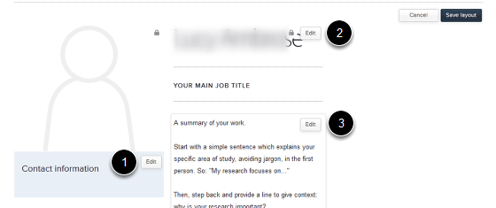

Edit your Profile - an overview
======================================================================================================

Log in
-------------------------------------------------------------------------------------------

   

1. Go to the Our Team section of the website.
2. Click on the Log in link.

Single Sign-On Login
-------------------------------------------------------------------------------------------

   

Enter your Single Sign-On Username and Password.

   

Click on the Continue to button. 

Find your profile
-------------------------------------------------------------------------------------------

   

Find and click on your name to bring up your Profile.

Empty profile
-------------------------------------------------------------------------------------------

   

To start editing your Profile click on the Edit button on the right hand side of the page.

Select a section
-------------------------------------------------------------------------------------------

   

Your Profile is divided up into sections:
1. Contact information
2. Your name and job title
3. Work summary area
Click on the Edit button in the section you would like to edit. This brings up the editing interface.

Editing interface
-------------------------------------------------------------------------------------------

   

Enter you details into the boxes as appropriate. Click on the Save button once you have made your changes.

See the tutorials:
**Change your Name and Job Title** - https://msdweb.zendesk.com/entries/22327547-change-your-name-or-job-title-on-a-profile
**Change you Contact Details** - https://msdweb.zendesk.com/entries/22327467-change-add-contact-details-on-your-profile

Save layout
-------------------------------------------------------------------------------------------

   

After making changes to any part of your Profile click on the Save layout button on the top right of the screen.

