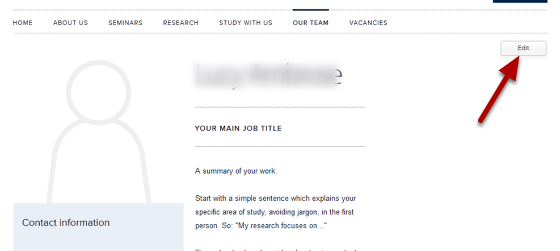
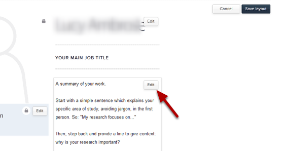
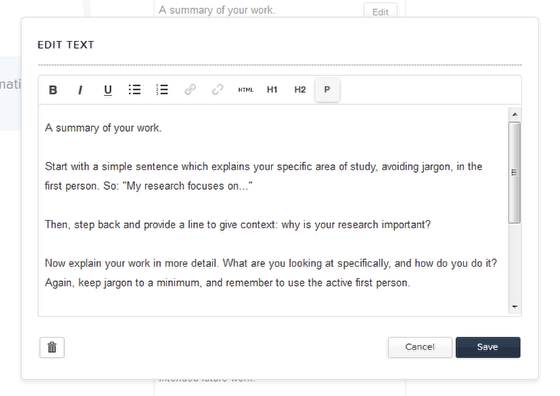
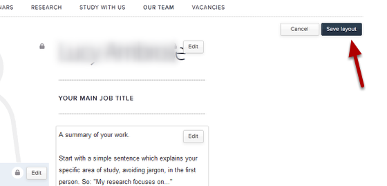

Edit your Work Summary
======================================================================================================

Go to your Profile
-------------------------------------------------------------------------------------------

   

Go to your Profile in the Our Team section of your website and click on the Edit button.

   

Click on the Edit button in the box below your name. This brings up a text editor.

Text editor
-------------------------------------------------------------------------------------------

   

Enter details of your work into the text editing box. 

The Text Editor ?????? (icons from left to right in the above image):

**1. Text formatting:**

B - Bold 
*I* - Italic
*U* - Underline - use underlining with caution as people expect underlined text on webpages to be links.

**2. Lists:**

Bulleted list
Numbered list

**3. Links:**

Link icon. Highlight the text you would like to create the link on and click on this icon, to bring up a box giving you various link options. See the tutorial on creating External and Internal Links for further details.
Remove link icon. Click somewhere in the link text and click on this icon to remove the link. 

**4. HTML:**

HTML - If you are familiar with HTML you might want view your page in HTML. Do this by clicking on this icon. 

**5. Text sizes:**

H1 - larger underlined heading
H2 - smaller heading
P - this is the default setting for paragraph text.

Remember to click on the Save button after making your changes.

Save layout
-------------------------------------------------------------------------------------------

   

Click on the Save layout button.

