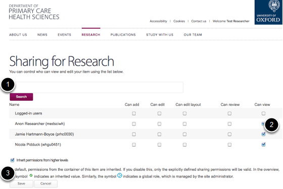
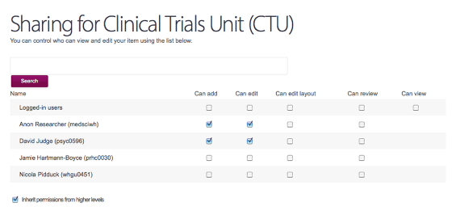

Enabling a Group Editor to Find their Group
======================================================================================================

.. note:: these user guides are being phased out and replaced with the guides on `Haiku Knowledge Base <https://fry-it.atlassian.net/wiki/display/HKB/Haiku+Knowledge+Base>`_

**WHY:** If your whole site is still unpublished it is difficult for your group editor to find their group. If your research section is published then you don't need to worry about this.	

Go to the Research Section
-------------------------------------------------------------------------------------------

   

You are going to make sure that your editor can see ('view') but not edit the entire research section.
Go to the Research section at the very top level of your website.
Click the Sharing link.

Assign the View permission
-------------------------------------------------------------------------------------------

   

1. Search for your editor.
2. Tick the 'Can View' box.
3. Click Save.

Add the Editor to their Group
-------------------------------------------------------------------------------------------

   

When you now go to the Group page and click the Sharing link, you will see that all the group editors are listed and that there is no box available to tick for 'Can View'. This is because they inherit that permission from the Research section.  You can still assign the Can add and Can edit rights to the particular editor of that Research Group.

