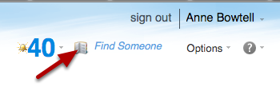
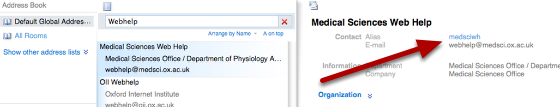

Finding an Oxford Username
======================================================================================================

.. note:: These user guides are being phased out and replaced with the guides on `Haiku Knowledge Base <https://fry-it.atlassian.net/wiki/display/HKB/Haiku+Knowledge+Base>`_

How to find an Oxford Username. Oxford usernames are published in the University's address book.	

Use the Global Address List in your Nexus account
-------------------------------------------------------------------------------------------

   

In the web interface, click the address book icon.

Search for the person
-------------------------------------------------------------------------------------------

   

The Oxford username is listed next to 'alias' in the address book entry.

