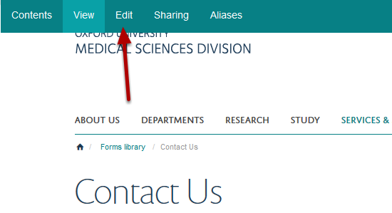
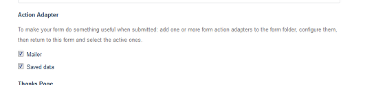
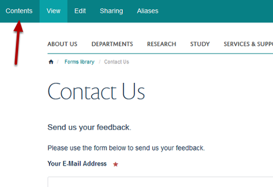
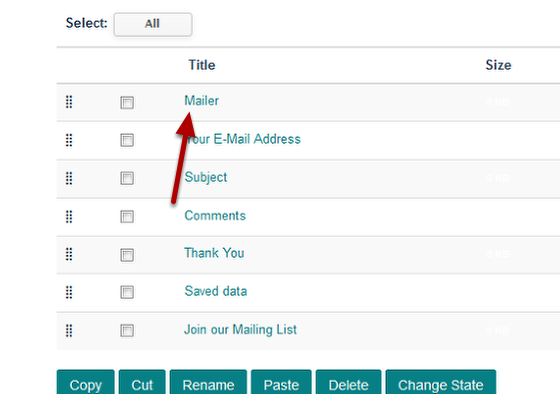
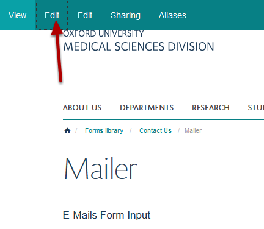
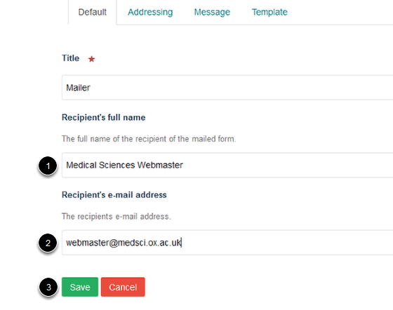
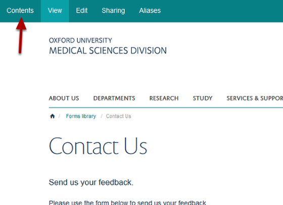
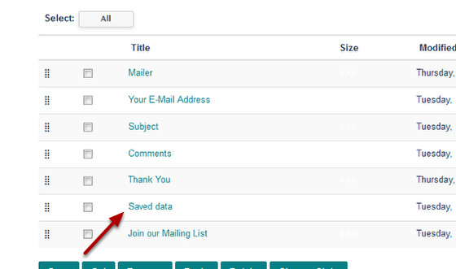
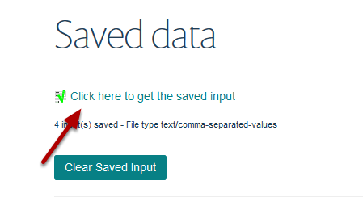
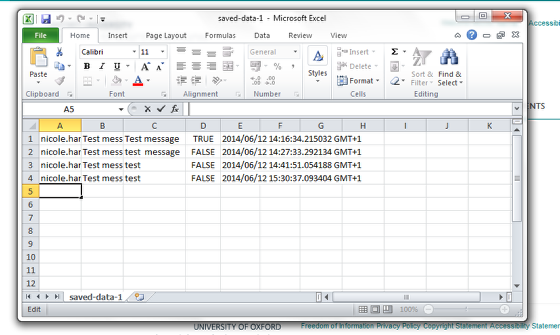

Forms - Data
======================================================================================================

.. note:: These user guides are being phased out and replaced with the guides on `Haiku Knowledge Base <https://fry-it.atlassian.net/wiki/display/HKB/Haiku+Knowledge+Base>`_

Form data can be emailed to you and / or saved to a CSV file.	

Set data options
-------------------------------------------------------------------------------------------

   

Go to your form. Click on **Edit**. 

Action Adpater
-------------------------------------------------------------------------------------------

   

Scroll down the page to the Action Adapter section. This controls how you will receive the form data. 

1. Select **Mailer** to receive the data by email each time the form is submitted. By default this is the email address of the person creating the form. See below for details of how to change the address. 
2. Select **Saved data** to save the data to a CSV file which you can download from your website. See below for details on how to do this. 

You can select both options. 

If make any changes here scroll down to the bottom of the page and click on **Save**. 

Change email address for form data
-------------------------------------------------------------------------------------------

   

By default form data will be emailed to the person who set up the form. To change this go to your form and click on **Contents** on the toolbar at the top of the page. 

   

Click on **Mailer.**

   

Click on **Edit**.

Enter email details
-------------------------------------------------------------------------------------------

   

1. Enter the name of the who the data will be emailed to.
2. Enter the email address.
3. Click on **Save**. 

Download CSV data file 
-------------------------------------------------------------------------------------------

   

To download data saved in a CSV file go to your form. Click on **Contents**.

   

Click on **Saved data**. 

   

Click on **Click here to get the saved input** to download your data:

   

