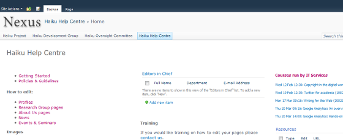

Getting Help
======================================================================================================

If you have problems you can use the Ask Us tab on the right of your screen, or email us.	

Ask Us Tab
-------------------------------------------------------------------------------------------

.. image:: images/Getting_Help/media_1390295700160.png
   :align: center
   

When you're logged in, you'll see an Ask Us tab to the right of your screen. Clicking on this should bring up a form to send a message straight to our help desk. 

Using your **Oxford email address** will ensure that the message gets to us promptly. 

It is sometimes useful to have information about the browser you are using and/or the operating system, so please give us those details if you think it is relevant.

Email Address
-------------------------------------------------------------------------------------------

We also have an email address for the helpdesk:

turnkey@medsci.ox.ac.uk

Again, sending from your **Oxford email address** will make sure that the message isn't blocked.

Knowledge base
-------------------------------------------------------------------------------------------

   

If you're reading this as a page in a pdf manual, then you may not be aware that all the sections in this manual are also available as separate topics in our Help Centre. We're constantly adding to this and it should be the location of most up-to-date information.

https://msdweb.zendesk.com/forums

What happens next
-------------------------------------------------------------------------------------------

You should get an acknowledgement in your inbox and we will aim to get back to you as soon as we can. If the problem is actually a bug in the system, then we'll send  your message to the developers - with further comments - and you may well be kept informed of progress.

