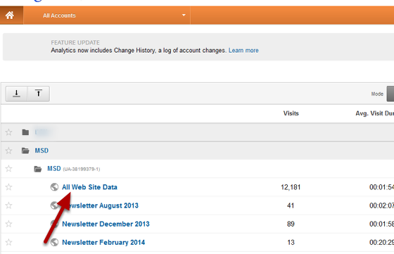
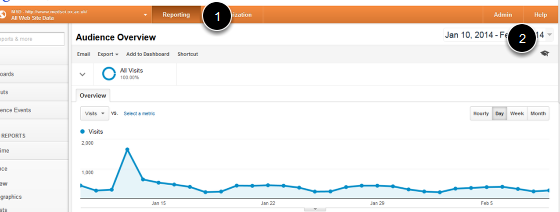
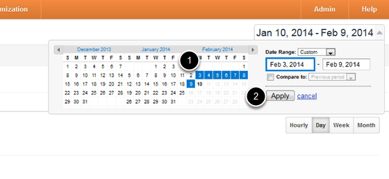
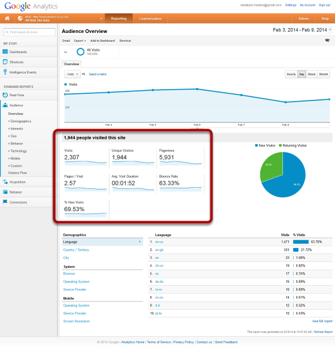
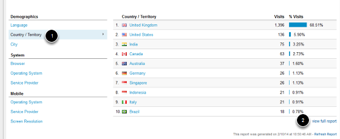

Google Analytics - Audience Overview
======================================================================================================

The Audience Overview page on Google Analytics provides you with details of the number of people who visit your site and the number of pages they view over a given period. You are also given information on where people are coming to your site from and the technology that they are using.
Google Analytics Help - http://support.google.com/analytics/?hl=en	

Login to Google Analytics
-------------------------------------------------------------------------------------------

   

Login to Google Analytics and go to your site. 

Reporting and date range
-------------------------------------------------------------------------------------------

   

1. Select Reporting
2. To set the date range click on the down arrow next to the dates on the right hand side. 

Set the date range
-------------------------------------------------------------------------------------------

   

1. Use the calendar to select the required date range for your data.
2. Click on Apply.

Audience Overview page
-------------------------------------------------------------------------------------------

   

The following data is available from the Audience Overview page:

**Visits: **this is the number of individual visitor sessions to your site (if someone leaves the site and returns within 30 minutes this is considered to be the same visit).
**Unique Visitors: **uniquely identified visitor using the site within a defined period of time. A visitor is usually identified by a combination of a machine and a browser.
**Pageviews: **a ****count of the number of pages that have been loaded. 
**Pages / Visit: **average number of pages viewed per visit to your site. Repeated views of a single page are counted. 
**Avg. Visit Duration: **total length of all visits divided by the number of visits.
**Bounce Rate:** the percentage of visits where the visitor only visited one page. 
**% New Visits: **percentage of visitors who had never visited the site before (or have cleared their cookies between visits).

Visitor location and technology
-------------------------------------------------------------------------------------------

   

Data on visitor location and technology is given at the bottom of the page.
1. Select the item that you would like to see data for.
2. The top ten result are given - for all data click on the view full report link. 

