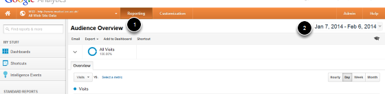
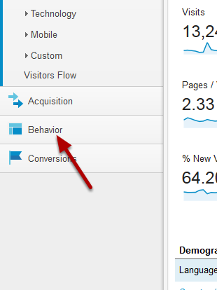
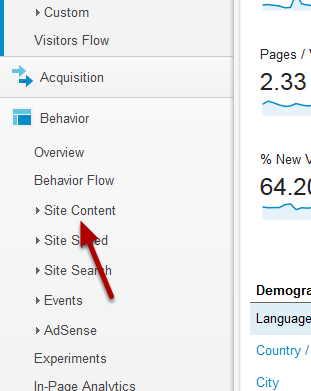
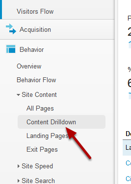
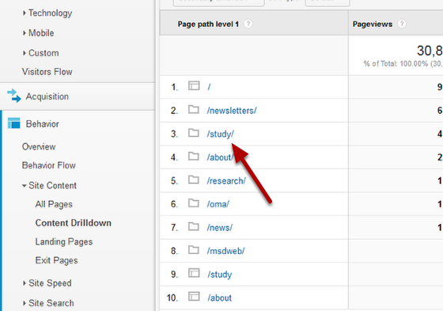
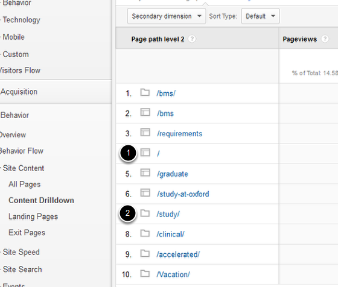
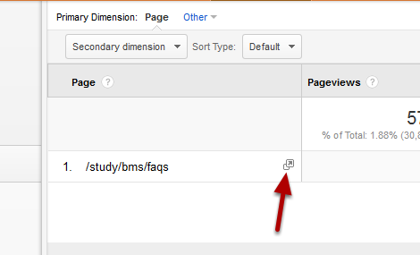
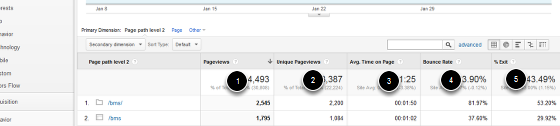

Google Analytics - Content Drilldown
======================================================================================================

Content Drilldown enables you to move through your site hierarchy seeing visitor numbers for sections and pages in your site. 	

Reporting
-------------------------------------------------------------------------------------------

   

Login to your Google Analytics account.
1. Select the Reporting option.
2. Select your required date range. You can change this by clicking on the date and selecting a new date range from a calendar. 

Behaviour
-------------------------------------------------------------------------------------------

   

Click on Behavior from the menu on the left side of the screen. 

Site Content
-------------------------------------------------------------------------------------------

   

Click on Site Content.

Content Drilldown
-------------------------------------------------------------------------------------------

   

Click on Content Drilldown to see user stats by directory: 

   

Click on a folder name to continue to move down the hierarchy.

Folders and pages
-------------------------------------------------------------------------------------------

   

You will have noticed that there are two different icons in the list:
1. This icon represents a homepage of a section/folder.
2. This icon represents a section/folder of your website.

   

Once you have reached the bottom of the hierarchy you won't be able to click any further and will see an open page icon. Click on this to open the page on your site. 

User statistics
-------------------------------------------------------------------------------------------

   

This view shows you the following statistics:
1. Pageviews - Total number of pages viewed. 
2. Unique Pageviews - Combines views of the same page by an individual user to record that as a single page view. 
3. Average Time spent on the Page. 
4. Bounce Rate - percentage of single page visits (where people arrive and leave your site on the same page).
5. % Exit - percentage of people who left the site from this folder/page.

