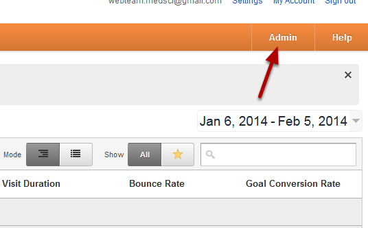
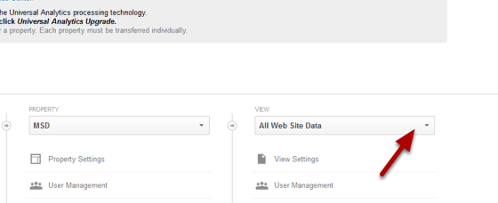
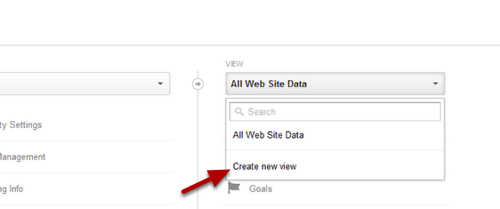
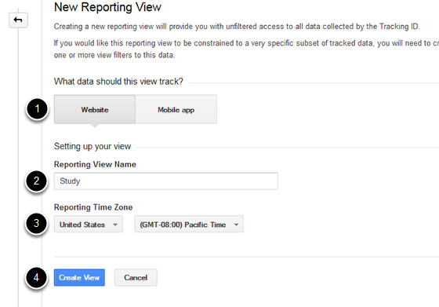
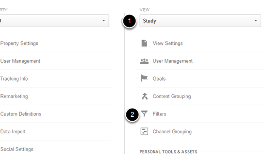
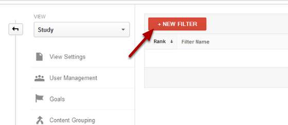
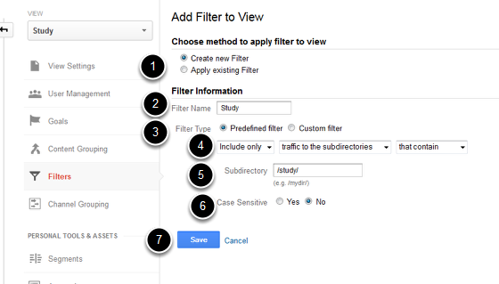
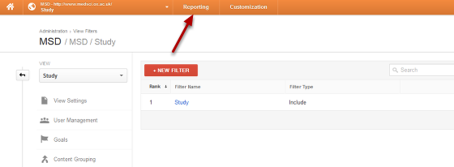
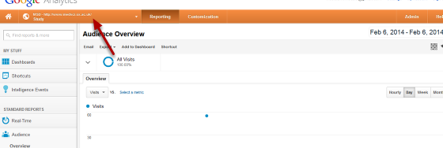

Google Analytics - Create a Sub-set of Data
======================================================================================================

You can set up a View in Google Analytics to create a specific set of data. To do this you need to set up a View and then a filter which limits the data recorded in the View.  	

Google Analytics Admin
-------------------------------------------------------------------------------------------

   

Log into your Google Analytics account and click on Admin. 

All Web Site Data
-------------------------------------------------------------------------------------------

   

Click on the All Web Site Data drop down list.

Create new view
-------------------------------------------------------------------------------------------

   

Click on Create new view.

New Reporting View
-------------------------------------------------------------------------------------------

   

1. Click on Website.
2. Give your View a name.
3. Change the reporting time to United Kingdom. 
4. Click on Create View.

Create filter
-------------------------------------------------------------------------------------------

   

1. The View you just created should now be displayed. If this hasn't happened click on the drop down list to manually select the view.  
2. Click on Filters. 

Set up filter
-------------------------------------------------------------------------------------------

   

Click on + New Filter.

   

To set up a filter which records traffic to a specific directory eg the study folder:

1. Select Create new Filter.
2. Name your filter.
3. Select Predefined filter.
4. Select Include only, traffic to the subdirectories, that contain.
5. Enter the name of the directory you would like to limit your data to. 
6. Select whether you want the filter to be case sensitive. 
7. Click on Save

See the Google Analytics Help site for information on the different types of filters you can set up (https://support.google.com/analytics/answer/1033162?hl=en-GB&ref_topic=1032939&rd=1)

View your stats
-------------------------------------------------------------------------------------------

   

Click on Reporting to see your user statistics.

   

You can switch between Views by clicking on the drop down list by the name of your site. Select your View from the drop down list in the reporting section. It can take up to 24 hours before you see statistics. 

