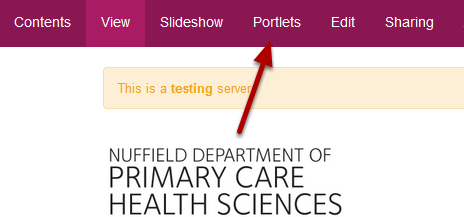
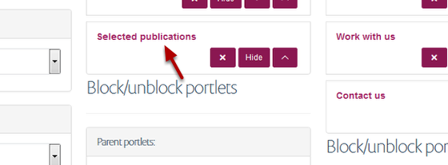
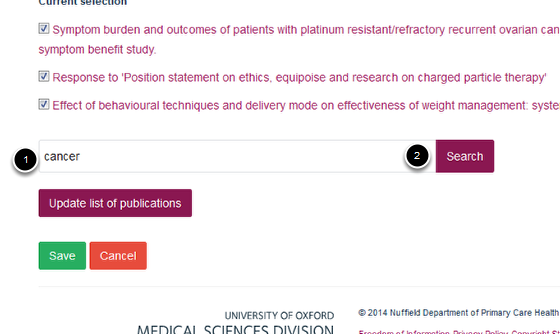
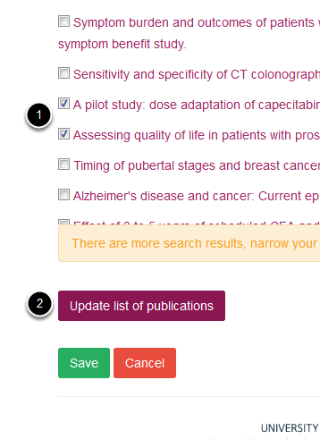
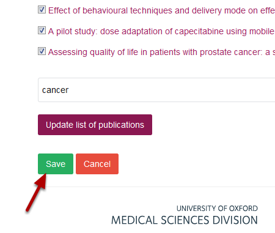

Homepage - Add Publications to a Selected Publications Portlet
======================================================================================================

.. note:: These user guides are being phased out and replaced with the guides on `Haiku Knowledge Base <https://fry-it.atlassian.net/wiki/display/HKB/Haiku+Knowledge+Base>`_

Shows you how to add publications to a Selected Publications Portlet. 	

Portlets
-------------------------------------------------------------------------------------------

   

Login to your site. Click on **Portlets** on the toolbar at the top of your homepage. 

Selected publications portlet
-------------------------------------------------------------------------------------------

   

Click on the name of your Selected Publications portlet.

   

1. Enter a keyword or publication title into the search box.
2. Click on **Search**.

   

1. Select the publications you would like to add to your publications list. 
2. Click on **Update list of publications**.

Save your changes
-------------------------------------------------------------------------------------------

   

Click on **Save**.

