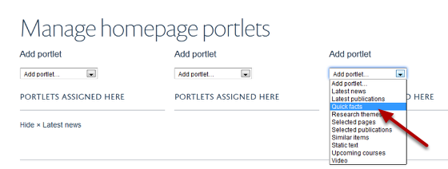
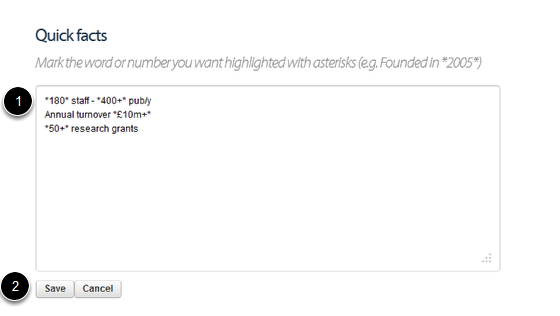

Homepage - Add Quick Facts Portlet
======================================================================================================

The Quick Facts box provides you with a straighforward way to draw attention to key information. Quick facts should be short and preferably include a number which can be highlighted to draw your site visitors to the Quick Facts box. This shows you how to add a Quick Facts portlet to your homepage. 	

Select Portlets
-------------------------------------------------------------------------------------------

   

Go to your homepage and click on the Portlets link on the toolbar at the top of the page. 

Add Quick facts portlet
-------------------------------------------------------------------------------------------

   

The homepage (below the slideshow) is divided into three columns. Each column is represented on this page by a drop down list. Select the column where you would like your Quick facts portlet to display and click on the dropdown list. Click on Quick facts. 

Enter your Quick facts
-------------------------------------------------------------------------------------------

   

1. Add your quick facts into the box - put each fact onto a separate line. You can highlight a number or a word to gain your reader's attention by putting asterisks around it.
2. Click on save.

