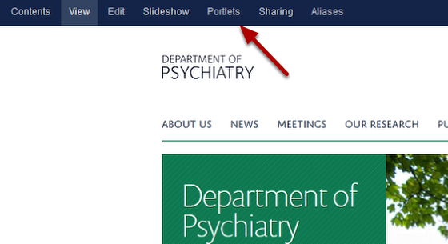
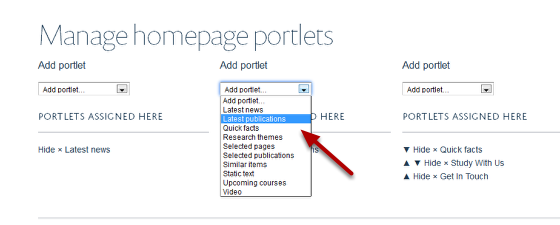
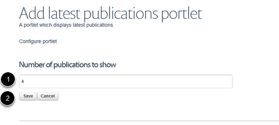

Homepage - Add a Latest Publications Portlet
======================================================================================================

The Latest Publications Portlet will add your department's most recent publications to your homepage. You have a choice of how many publications you would like to display. 	

Select Portlets
-------------------------------------------------------------------------------------------

   

Go to your homepage and click on Portlets on the toolbar at the top of the page. 

Select Latest Publications
-------------------------------------------------------------------------------------------

   

The homepage (below the slideshow) is divided into three columns. Each column is represented on this page by a drop down list. Select the column where you would like your Latest publications portlet to display and click on the dropdown list. Click on Latest publications.

Choose number of publications
-------------------------------------------------------------------------------------------

   

1. Enter the number of publications you would like to show on your homepage.
2. Click on the Save button.

