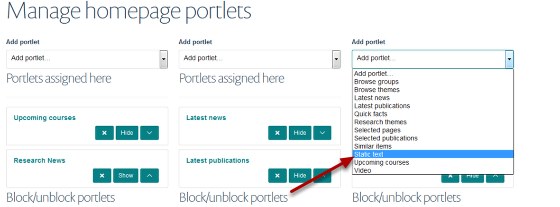
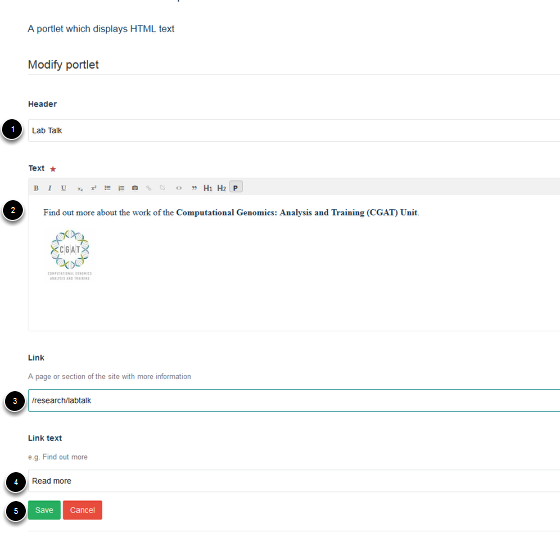

Homepage - Add a Static Text Portlet
======================================================================================================

.. note:: These user guides are being phased out and replaced with the guides on `Haiku Knowledge Base <https://fry-it.atlassian.net/wiki/display/HKB/Haiku+Knowledge+Base>`_

A Static Text Portlet enables you to add a text box with a link to another part of your site.	

Portlets
-------------------------------------------------------------------------------------------

   

Go to your homepage and click on Portlets on the toolbar at the top of the page. 

   

The homepage (below the slideshow) is divided into three columns. Each column is represented on this page by a drop down list. Select the column where you would like your Text portlet to display and click on the dropdown list. Click on **Static Text**.

   

Enter portlet details:
1. Title
2. Portlet content
3. If you would like the portlet to link to part of your site enter the address in here (enter the part of the address following ox.ac.uk)
4. If you have specified a link enter text for the link button
5. Save your changes. 

This will create the following portlet:

   

