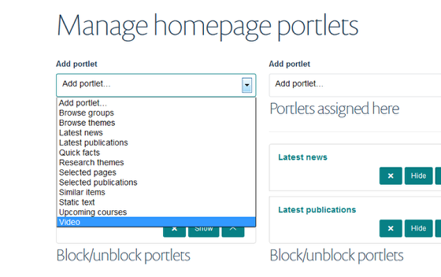
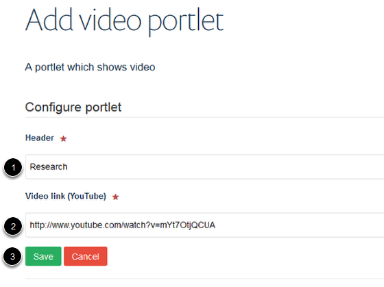

Homepage - Add a YouTube Video to your Homepage
======================================================================================================

.. note:: These user guides are being phased out and replaced with the guides on `Haiku Knowledge Base <https://fry-it.atlassian.net/wiki/display/HKB/Haiku+Knowledge+Base>`_

This shows you how to add a YouTube video to your homepage. 	

Portlets
-------------------------------------------------------------------------------------------

   

Go to your homepage. Click on **Portlets**.

Add Video
-------------------------------------------------------------------------------------------

   

The homepage (below the slideshow) is divided into three columns. Each column is represented on this page by a drop down list. Select the column where you would like your YouTube Video portlet to display and click on the dropdown list. Click on **Video**.

Video details
-------------------------------------------------------------------------------------------

   

1. Enter a title for your video.
2. Enter the web address of the YouTube video you would like add.
3. Click on **Save**.

Your video
-------------------------------------------------------------------------------------------

.. image:: images/Homepage_-_Add_a_YouTube_Video_to_your_Homepage/media_1403082830106.png
   :align: center
   

