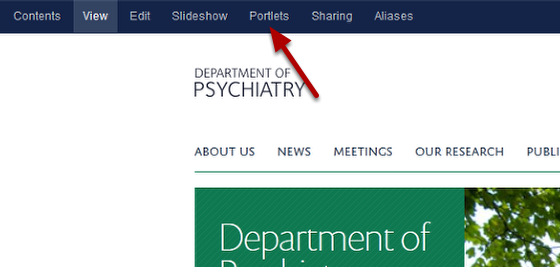
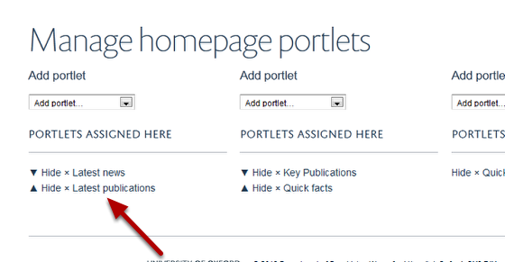
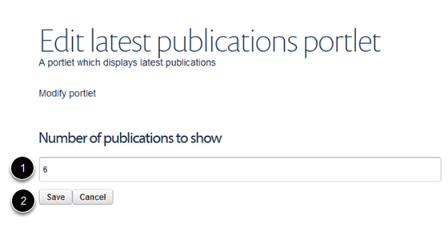

Homepage - Change the Number of Latest Publications on Display
======================================================================================================

.. note:: These user guides are being phased out and replaced with the guides on `Haiku Knowledge Base <https://fry-it.atlassian.net/wiki/display/HKB/Haiku+Knowledge+Base>`_

You can choose how many of your department's latest publications you would like to display on your homepage. If you would prefer to select specific publications rather than displaying the most recent publications see the tutorials on the Selected publications portlet. 	

Select Portlets
-------------------------------------------------------------------------------------------

   

Go to your homepage and click on the Portlets link on the toolbar at the top of the page. 

Go to Latest publications
-------------------------------------------------------------------------------------------

   

Click on the Latest publications portlet.

Number of publications
-------------------------------------------------------------------------------------------

   

1. Enter the number of publications you would like to have displayed on your homepage. 
2. Save you changes.

