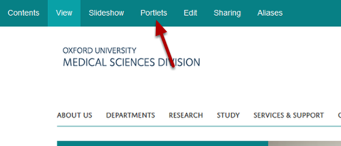
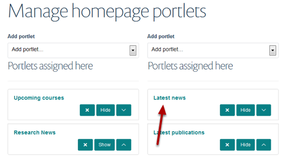

Homepage - Change the Number of News Items on Display
======================================================================================================

You can choose how many news items you would like to display on your homepage. This shows you how to do this. 	

Homepage Portlets
-------------------------------------------------------------------------------------------

   

Go to the homepage and click on **Portlets** on the tool bar at the top of the page. 

Find Latest news portlet
-------------------------------------------------------------------------------------------

   

Click on the **Latest news** portlet.

Change number of news items
-------------------------------------------------------------------------------------------

.. image:: images/Homepage_-_Change_the_Number_of_News_Items_on_Display/media_1403259081997.png
   :align: center
   

1. Enter the number of news items you would like to display on the homepage in the box.
2. Click on **Save**.

