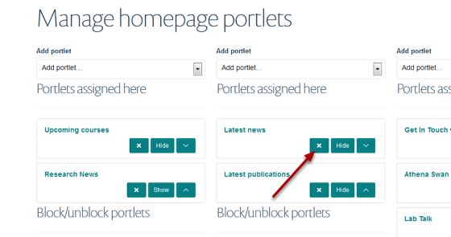

Homepage - Delete a Portlet
======================================================================================================

.. note:: These user guides are being phased out and replaced with the guides on `Haiku Knowledge Base <https://fry-it.atlassian.net/wiki/display/HKB/Haiku+Knowledge+Base>`_

This shows you how to delete a Portlet from your homepage. You can also hide Portlets which prevent them from displaying but doesn't delete them.	

Select Portlets
-------------------------------------------------------------------------------------------

   

Go to your homepage and click on **Portlets**.

Find Portlet to be deleted
-------------------------------------------------------------------------------------------

   

Find the Portlet you would like to delete and click on the cross next to its name. 

