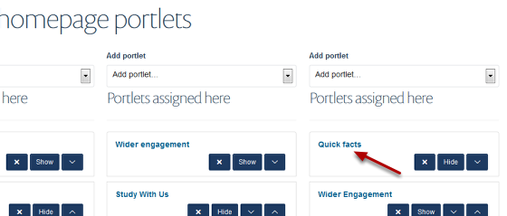
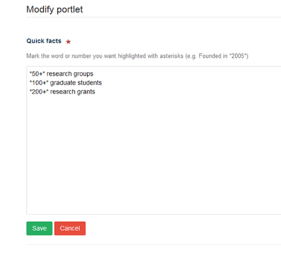

Homepage - Edit a Quick Facts Portlet
======================================================================================================

.. note:: These user guides are being phased out and replaced with the guides on `Haiku Knowledge Base <https://fry-it.atlassian.net/wiki/display/HKB/Haiku+Knowledge+Base>`_

Quick Facts enable you to draw attention to key department information. They should be short and prefereably include a number which can be highlighted to draw your site visitors to the Quick Facts box. This shows you how to edit the Quick Facts on your homepage. 	

Select Portlets
-------------------------------------------------------------------------------------------

   

Go to your homepage. Click on **Portlets** on the toolbar at the top of the page. 

Find the Quick Fact Portlet
-------------------------------------------------------------------------------------------

   

Click on **Quick facts**.

Edit your facts
-------------------------------------------------------------------------------------------

   

Make your changes to the quick facts in the box. Each fact should be on a separate line. You can highlight a number or a word to gain your reader's attention by putting asterisks around it.
Save your changes.

