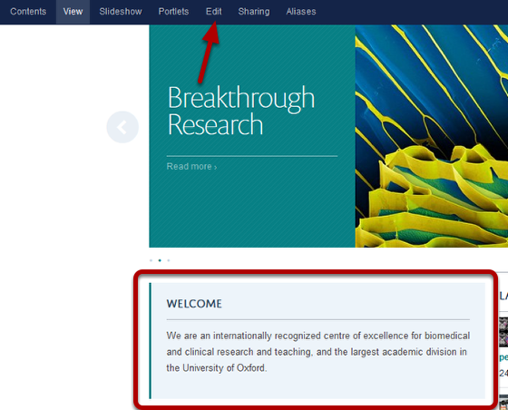
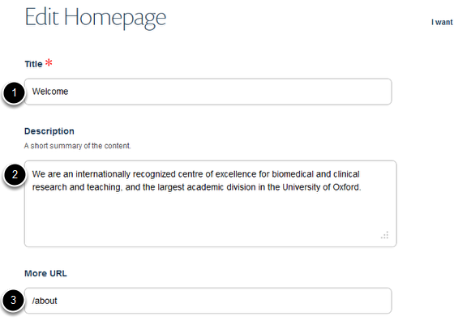
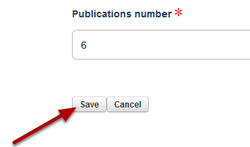

Homepage - Edit the Welcome Box
======================================================================================================

This show you how to edit the Welcome box under the slideshow on the left hand side of your homepage. In this example we will add a Find out more arrow link to the about us section of the site. 	

Edit homepage
-------------------------------------------------------------------------------------------

   

To edit the Welcome box on the homepage go to the homepage and click on Edit on the toolbar at the top of the page. 

Make your changes
-------------------------------------------------------------------------------------------

   

Make your changes:
1. The title of the box
2. The text content of your box
3. If you would like to link to another part of your site with a Find out more arrow enter the address here (enter the part of the address after .ox.ac.uk). 
In this example we have added the /about to create a Find out more arrow linking to the about us section.

Save your changes
-------------------------------------------------------------------------------------------

   

Scroll to the bottom of the page and click on the Save button.

Updated page
-------------------------------------------------------------------------------------------

   

Your page now includes a Find out more arrow.

