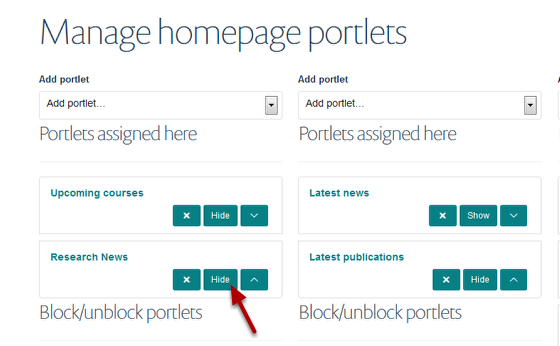
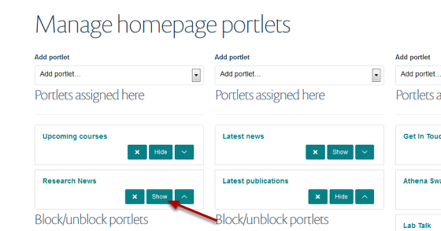

Homepage - Hide/Show a Portlet
======================================================================================================

You can hide a Portlet from displaying on the your homepage. 	

Select Portlets link
-------------------------------------------------------------------------------------------

   

Go to your homepage. Click on **Portlets** on the toolbar at the top of the page.

Hide the Portlet
-------------------------------------------------------------------------------------------

   

Find the Portlet you would like to hide and click on **Hide**. The Portlet will now not display on the homepage. 

Show the Portlet
-------------------------------------------------------------------------------------------

   

The button has now changed to Show. When you want to display the portlet again click on Show. 

