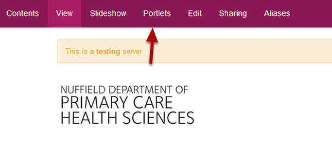
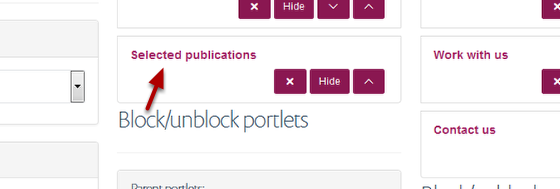
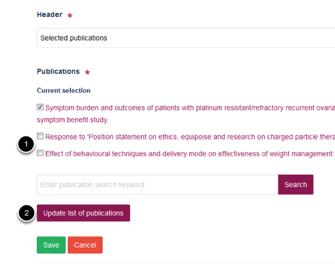
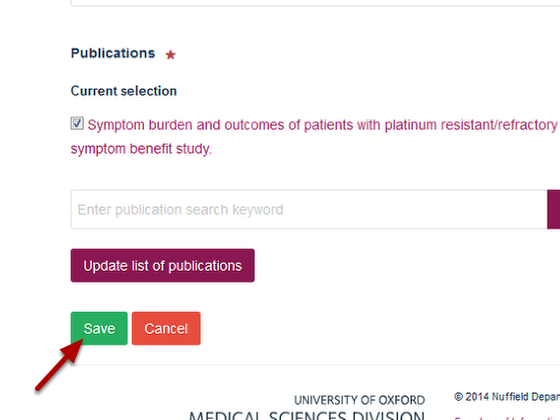

Homepage - Remove Publications from a Selected Publications Portlet
======================================================================================================

Shows you how to remove a publication from a selected publications portlet. 	

Portlets
-------------------------------------------------------------------------------------------

   

Login to your site.
Click on Portlets on the homepage. 

Selected Publications Portlet
-------------------------------------------------------------------------------------------

   

Click on the name of your Selected Publications Portlet.

Remove publications
-------------------------------------------------------------------------------------------

   

1. Unselect the check boxes next to the publications you would like to remove.
2. Click on **Update list of publications**.

Save your changes
-------------------------------------------------------------------------------------------

   

Click on **Save**.

