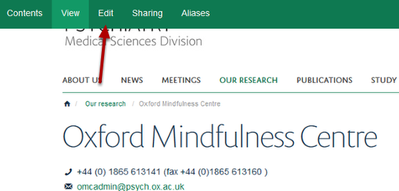

Link a Logo on a Research Group Page to a Website
======================================================================================================

.. note:: These user guides are being phased out and replaced with the guides on `Haiku Knowledge Base <https://fry-it.atlassian.net/wiki/display/HKB/Haiku+Knowledge+Base>`_

You can link a logo on a Research Group Page to a website. The website address will also display in the contacts section below the logo. To find out how to add a logo to a Research Group page consult the **Add a Logo to a Research Group Page** tutorial.	

Select Edit
-------------------------------------------------------------------------------------------

   

Go to the Research Group and click on **Edit** on the toolbar at the top of the screen. 

Website URL
-------------------------------------------------------------------------------------------

   

1. Scroll down the page until you see the **Website URL** box. Enter your website address in here.
2. Click on the **Save** button.

