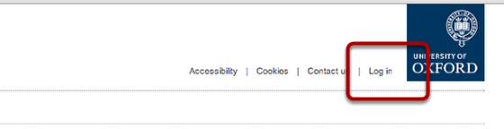
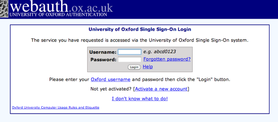
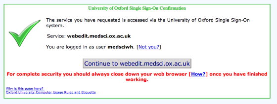
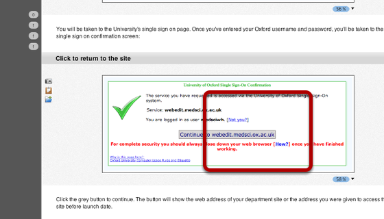
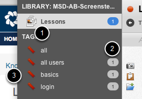
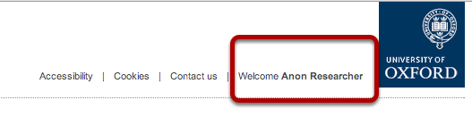

Log In to Your Site with Single Sign On
======================================================================================================

How to log in to the website. Your single sign on username and password are the ones you use for your Oxford Nexus email account.	

Click the log in link
-------------------------------------------------------------------------------------------

   

You'll find this just to the left of the University brand mark.

Sign In
-------------------------------------------------------------------------------------------

   

You will be taken to the University's single sign on page. Once you've entered your Oxford username and password, you'll be taken to the single sign on confirmation screen:

Click to return to the site
-------------------------------------------------------------------------------------------

   

Click the grey button to continue. The button will show the web address of your department site or the address you were given to access the site before launch date.

   

   

You are now logged in
-------------------------------------------------------------------------------------------

   

You will be returned to the site and you should see your name next to the University brandmark. Pages on the site won't look any different until you reach a page you have permission to edit.

