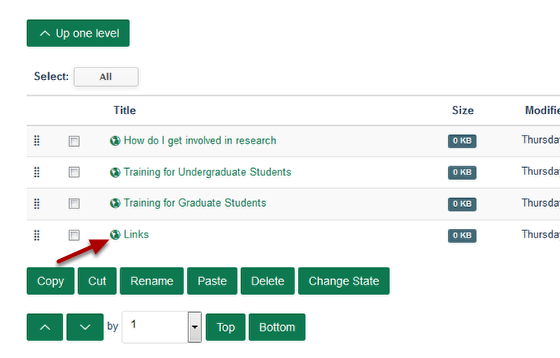

Move Content from one Listing Column to another Listing Column
======================================================================================================

.. note:: These user guides are being phased out and replaced with the guides on `Haiku Knowledge Base <https://fry-it.atlassian.net/wiki/display/HKB/Haiku+Knowledge+Base>`_

   

In this example the Links content from the right hand Announcements column will be moved to the middle Taking Part column.

Switch to contents view
-------------------------------------------------------------------------------------------

   

Go to the Research Group page where you want to move the column content. 
Click on Contents on the tool bar at the top left hand side of the page. 

The Research Group columns
-------------------------------------------------------------------------------------------

   

The Contents view shows you a list of the Research Group's columns. 
Click on the column name where you would like to move content from. This lists the content of that column:

Column content
-------------------------------------------------------------------------------------------

   

1. Click on the check box next to content you would like to move. 
2. Click on **Cut**.
3. Click on the **^ Up one level** button to move back to the list of columns.

Select the new column
-------------------------------------------------------------------------------------------

   

Select the column where you wish to move the content to by clicking on the column name. 

Move the content
-------------------------------------------------------------------------------------------

   

Click on **Paste** to move the content to the new column. 

Moved content
-------------------------------------------------------------------------------------------

   

You will see that the moved content has been added to the bottom of the new column.

.. image:: images/Move_Content_from_one_Listing_Column_to_another_Listing_Column/media_1403853717097.png
   :align: center
   

Viewing the Research Group webpage you will see that Links now appear in the Taking Part column.

