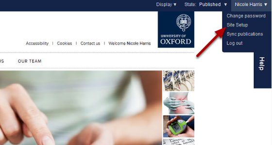
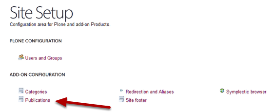
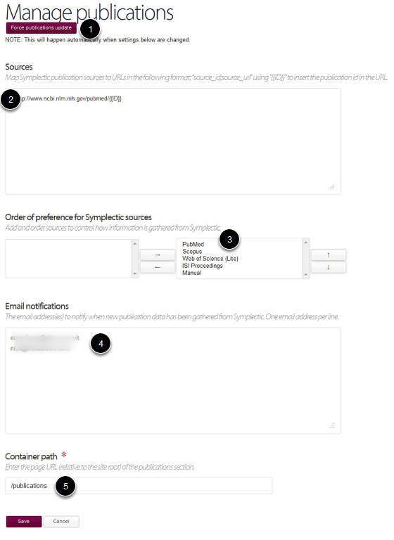

Publications - Site Setup
======================================================================================================

The Publications page on the Site Setup menu gives you several options for the administration of publications on your website. This explains how these options work. 	

Go to Site Setup
-------------------------------------------------------------------------------------------

   

To get to the Publications section click on your name on the top right hand side of the tool bar at the top of the screen.

Select Site Setup.

Publications
-------------------------------------------------------------------------------------------

   

Click on the Publications link.

Manage publications 
-------------------------------------------------------------------------------------------

   

1. The publications feed from Symplectic to the website is updated every night. If you need the update to happen more quickly click on the Force Publications Update button. Your request will be placed into a queue - there is likely to be a time-lag between pressing the button and publications newly added to Sympletic appearing. 
2. The URL entered into this box creates links through to the article details on PubMed. 
3. These are the sources which Sympletic uses. Where publication information is available from more than one source details are taken from the first source in the list that they appear in. If you would like to change the order of these sources please contact us (turnkey@medsci.ox.ac.uk). 
4. If you would like to receive an email notification when new publications have been added to your website enter you email address in this box. You can enter multiple address - add each address to a new line.
5. This is the web address of the section of the website where your publications display. 

