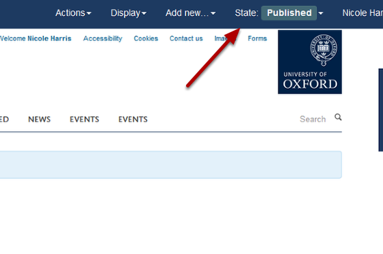

Publish your Webpage
======================================================================================================

When you create a new webpage it won't be visible to the public. It will only be visible to someone who is logged in and has rights to edit that page. To make the page visible you need to change the State of the page from **New** to **Published**. 	

Page State
-------------------------------------------------------------------------------------------

   

Click on **State** on the right hand side of the top toolbar. 

Publish
-------------------------------------------------------------------------------------------

   

Select **Publish**.

Published page
-------------------------------------------------------------------------------------------

   

You will see that the State of the page has changed to **Published** and will now be visible to the public.

