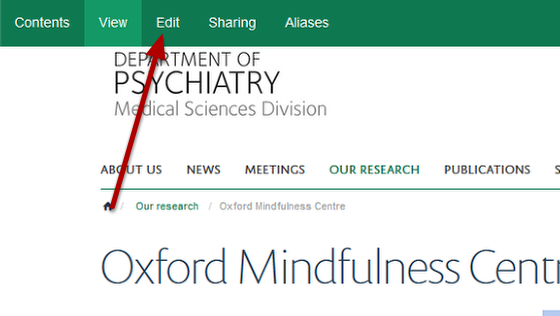
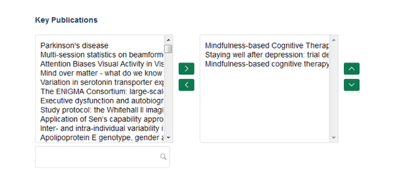
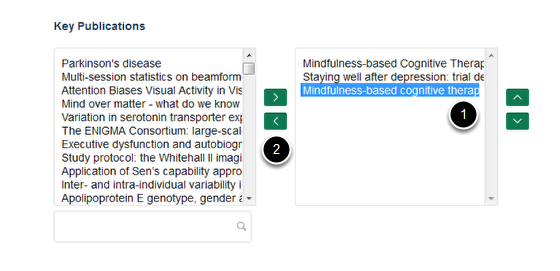
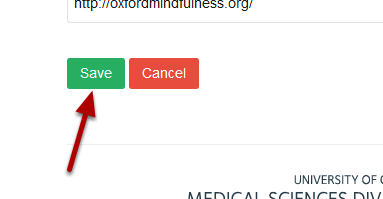

Remove Publications from a Research Group Page 
======================================================================================================

.. note:: These user guides are being phased out and replaced with the guides on `Haiku Knowledge Base <https://fry-it.atlassian.net/wiki/display/HKB/Haiku+Knowledge+Base>`_

This shows you how to remove publications which have been added to a Research Group page. The publications will be moved back into the general pool of publications.	

Select edit mode
-------------------------------------------------------------------------------------------

   

Go to your Research Group page. Click on **Edit** on the tool bar at the top of the page.

Remove publications
-------------------------------------------------------------------------------------------

   

Scroll down the page until you reach the **Key Publications** section near the bottom of the page.
The box on the left hand side contains all publications entered into Symplectic by members of your department. The box on the right hand side contains publications appearing on your Research Group page.

   

To remove publications:
1. Highlight the titles in the right hand column.
2. Click on the bottom arrow to move the publications back into the list of available publications. 

Save your changes
-------------------------------------------------------------------------------------------

   

Scroll to the botoom of the page. Click on **Save**.

