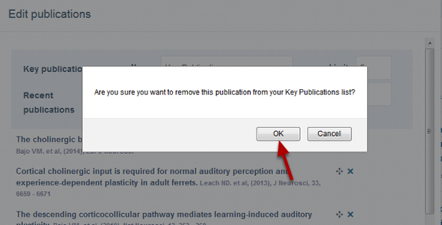

Remove a Key Publication
======================================================================================================

You can list up to five publications under the Key Publications list. This shows you how to remove one of these publications. 
Removing the publications from your list of Key Publications doesn't delete the publication - it will still be included in the list of all your publications. 	

Edit your Profile
-------------------------------------------------------------------------------------------

   

Click on the **Edit my profile** button just below the University logo.

Edit your Key Publications
-------------------------------------------------------------------------------------------

   

Click on the **Edit** button next to the Key Publications heading. This button will appear when you place your cursor on the Key Publications tile. 

Remove the publication
-------------------------------------------------------------------------------------------

   

Click on the cross next to the publication you would like to remove. 

   

Click on **OK**.

   

Click on the **Save** button.

